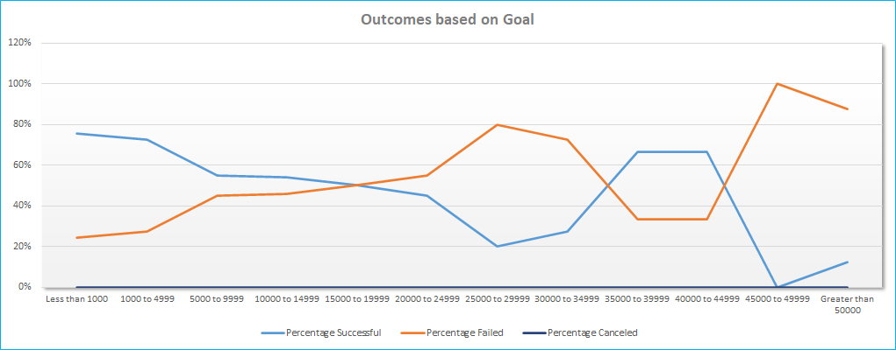

# Kickstarting with Excel

## Overview of Project
Following a successful fundrasing campaign, our client "Louise" would now like to find out how different campaigns faired in relation to their launch dates and their funding goals

### Purpose
The analysis helps Louise to make strategic decisions such as the launch date and campaign goal on her next fundraising campaign

## Analysis and Challenges
Used the kickstarter data for the analysis. 
Converted the launch date that were in Unix time to a date type.
Separated the fields for the category and subcategory to be able to filter on those separately
Created a separate field for the year for pivot filtering

### Analysis of Outcomes Based on Launch Date
We first started off by creating a pivot table for the Theatre campaigns by launch month.
We extrapolated the month from the launch date in the pivot table 
 
and then created a line chart to show the outcome trend for each month 

### Analysis of Outcomes Based on Goals
We first created a new table to capture the below measures 
 
We then created a line chart using the new table to show the trend for the outcomes 
 

### Challenges and Difficulties Encountered
We noticed that when we add the date to the pivot table it shows the years, to overcome this issue we had to group and ungroup the date field in the pivot and then choose only the date

## Results

- What are two conclusions you can draw about the Outcomes based on Launch Date? 
	Theatre campaings have a much higher successful outcome in the month of May 
  The worst month for launching the theatre campaigns is December 
    
- What can you conclude about the Outcomes based on Goals? 
   Plays campaings have a (76-24) 51% better chance to be successful when the goal is Less than 1000 
   Plays campaings with goal between 35000 to 45000 have (67-33) 34% better chance to be successful 
   The worst range for the Plays campaign is 25000 to 30000

- What are some limitations of this dataset? 
  The data set has some outliers for the theatre campaign goals  in excess of 1,000,000 that can skew the results 
  The currency can affect the actual goal
  
- What are some other possible tables and/or graphs that we could create? 
  Create a table for the range of percentage funded and check the range of goals vs this for the failed campaigns 
  create a bar chart for the above table
